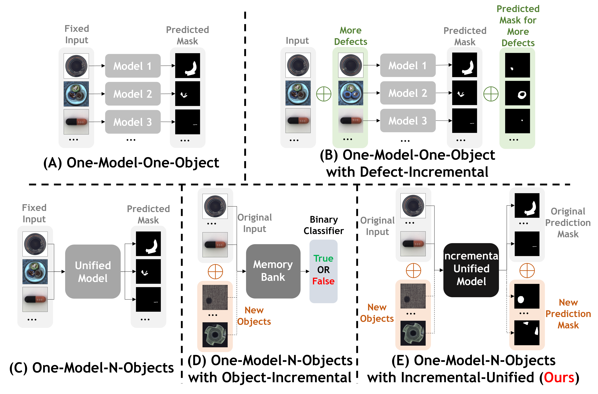
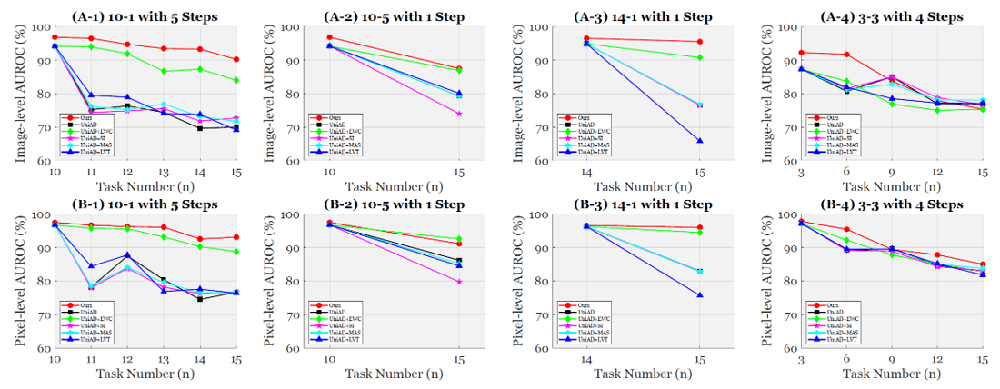
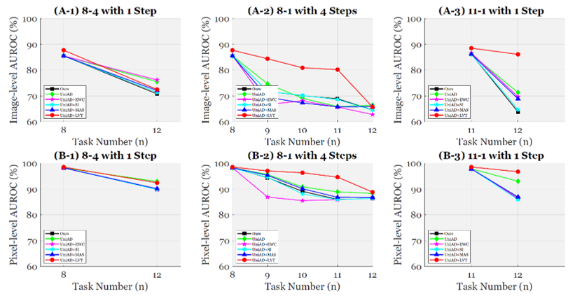

<div align="center">

# [ECCV 2024] An [Incremental Unified Framework](https://link.springer.com/chapter/10.1007/978-3-031-72751-1_18) for Small Defect Inspection

### This is the official repository for [IUF](https://link.springer.com/chapter/10.1007/978-3-031-72751-1_18) (ECCV 2024).

[Jiaqi Tang](https://jqt.me/), [Hao Lu](https://scholar.google.com/citations?user=OrbGCGkAAAAJ&hl=zh-CN), [Xiaogang Xu](https://xuxiaogang.com/), [Ruizheng Wu](https://scholar.google.com/citations?user=OOagpAcAAAAJ&hl=en), [Sixing Hu](https://david-husx.github.io/), 

Tong Zhang, Twz Wa Cheng, [Ming Ge](https://www.linkedin.com/in/ming-ge-7817242a/?originalSubdomain=hk), [Ying-Cong Chen*](https://www.yingcong.me/) and [Fugee Tsung](https://ieda.ust.hk/dfaculty/tsung/).

*: Corresponding Author

[](https://github.com/jqtangust/IUF/blob/master/LICENSE) [](https://code.visualstudio.com/) [](https://badges.strrl.dev)

Here is our [Project Page](https://jqt.me/_IUF_/) with Video!

</div>

## 🔍 **Our Setting:** Incremental Unified Framework (IUF)
- 🚩 **First framework** to integrate incremental learning into the unified reconstruction-based detection.
- 🚩 Overcoming memory bank capacity limitations.
- 🚩 Delivering not only image-level performance but also pixel-level location.

<div align="center">
  
</div>


## 📢 **News and Updates**

- ✅ Step 24, 2024. We release the **code** and **dataset** of IUF. Check this Google Cloud link for [DOWNLOADING](https://drive.google.com/file/d/1jh9BPRN-YWxEU5OOSeds4jecYIbLc6zS/view?pli=1) dataset.


## ▶️ **Getting Started**

<!-- 1. [Installation](#installation)
2. [Dataset](#dataset)
3. [Configuration](#configuration)
5. [Testing](#Testing)
4. [Training](#Training) -->

### 🪒 *Installation*
- *PyTorch >= 1.11.0*
- *Install dependencies by*
    ```
    pip install -r requirements.txt
    ```


### 💾 *Dataset Preparation*

- Google Drive Link for [DOWNLOADING](https://drive.google.com/file/d/1jh9BPRN-YWxEU5OOSeds4jecYIbLc6zS/view?pli=1) dataset.
- The dataset is organized as follows:

    ```
    ├── VisA
    │   ├── Data
    │   │   ├── candle
    │   │   │   └── ground_truth —— (bad)
    │   │   │   └── test —— (Bad) (good)
    │   │   │   └── train (good)
    │   │   ├── capsules
    │   │   │   └── ...
    │   │   └── ...
    │   │   
    │   ├── orisplit
    │   │   ├── candle_test.json # for testing in candle 
    │   │   ├── candle_test.json # for training in candle 
    │   │   └── ...
    |   │
    │   └── split
    │   │   ├── 8_12_train.json # for training in 8-12 class 
    │   │   ├── 8_test.json # for training in 1-8 class 
    │   │   └── 11_test.json # for training in 1-11 class 
    │
    ├── MvTec AD
    │   ├── mvtec_anomaly_detection # Data
    │   ├── 33333 # for 33333 class
    │   ├── json_test # for each class test
    │   ├── json_train # for each class train
    │   ├── test_X.json # for X class test
    │   ├── train_X.json  # for X class Train
    │   └── ...
    ```

- **Task Protocols**: Based on the practical requirements of industrial defect inspection, we set up our experiments in both **single-step** and **multi-step** settings. 
    We represent our task stream as $\mathbf{X - Y \ with \ N \ Step(s)}$. Here, $\mathbf{X}$ denotes the number of base objects before starting incremental learning, $\mathbf{Y}$ represents the number of new objects incremented in each step, and $\mathbf{N}$ indicates the number of tasks during incremental learning. When training on base objects, $\mathbf{N} = 0$, and after one step, $\mathbf{N} = \mathbf{N} + 1$. Our task stream is shown as follows:
    - MVTec-AD: $\mathbf{14-1\ with \ 1\ Step}$, $\mathbf{10-5\ with \ 1\ Step}$, $\mathbf{3 - 3\ with \ 4\ Steps}$ and $\mathbf{10-1\ with \ 5\ Steps}$.
    - VisA: $\mathbf{11-1\ with \ 1\ Step}$, $\mathbf{8-4\ with \ 1\ Step}$, $\mathbf{8-1\ with \ 4\ Steps}$
  
- **Usage: follow the above protocols in incremental learning.**

### 🔨 *Configuration*

- The configuration files for [`training`](/dataset/ruizhengwu/SmallDefect_Vis/IUF/experiments/VisA/8_1_1_1_1) in [`experiments`](/dataset/ruizhengwu/SmallDefect_Vis/IUF/experiments).

- Dataset Setting:

  ```
    dataset:
    type: custom

    image_reader:
        type: opencv
        kwargs:
        image_dir: /dataset/.../VisA # for data path
        color_mode: RGB

    train:
        meta_file: /dataset/.../A_Data/orisplit/XX.json # for data training json path
        rebalance: False
        hflip: False
        vflip: False
        rotate: False
    
    Val:
        meta_file: /dataset/.../.../VisA/split/XX.json # for saving previous weight

    test:
        meta_file: /dataset/.../A_Data/orisplit/XX.json # for data testing json path
  ```

- Saving Setting:

  ```
    saver:
    auto_resume: True
    always_save: True
    load_path: checkpoints/ckpt.pth.tar
    save_dir: checkpoints/
    log_dir: log/
  ```

- For Testing: uncomment this part in config
    ```
    vis_compound:
       save_dir: vis_compound
       max_score: null
       min_score: null
     vis_single:
       save_dir: ./vis_single
       max_score: null
       min_score: null
    ```

### 🖥️ *Training and Testing*

- Modify `Dataset Setting` in [`training`](/dataset/ruizhengwu/SmallDefect_Vis/IUF/experiments/VisA/8_1_1_1_1) configuration, then run
  ```
  sh run.sh
  ```
  In `run.sh`, it includes two stages:
  ```
  cd /dataset/.../SmallDefect_Vis/IUF

  # Stage 1: Training base objects
  CUDA_VISIBLE_DEVICES=0,1,2,3 python ./tools/train_val.py --config /dataset/.../SmallDefect_Vis/IUF/experiments/VisA/8_1_1_1_1/config_c1.yaml

  # Stage 2: Training incremental objects
  CUDA_VISIBLE_DEVICES=0,1,2,3 python ./tools/train_val.py --config /dataset/.../SmallDefect_Vis/IUF/experiments/VisA/8_1_1_1_1/config_c9.yaml

  CUDA_VISIBLE_DEVICES=0,1,2,3 python ./tools/train_val.py --config /dataset/.../SmallDefect_Vis/IUF/experiments/VisA/8_1_1_1_1/config_c10.yaml

  CUDA_VISIBLE_DEVICES=0,1,2,3 python ./tools/train_val.py --config /dataset/.../SmallDefect_Vis/IUF/experiments/VisA/8_1_1_1_1/config_c11.yaml

  CUDA_VISIBLE_DEVICES=0,1,2,3 python ./tools/train_val.py --config /dataset/.../SmallDefect_Vis/IUF/experiments/VisA/8_1_1_1_1/config_c12.yaml

  ```
  *You can edit this to support different task protocals.*

- The logs, models and training states will be saved to `./experiments/checkpoints/...` and `./experiments/logs/...`. You can also use `tensorboard` for monitoring for the `./events_dec/...`.

## ⚡ **Performance**
Compared with other baselines, our model achieves state-of-the-art performance:

> ⭐ **[Figure 1] Quantitative evaluation in MvTecAD.**
> 

> ⭐ **[Figure 2] Quantitative evaluation in VisA.**
> 


> ⭐ **[Figure 3] Qualitative Evaluation.**
> 

## 🌐 **Citations**

**The following is a BibTeX reference:**

``` latex
@inproceedings{tang2024incremental,
  title = {An Incremental Unified Framework for Small Defect Inspection},
  author = {Tang, Jiaqi and Lu, Hao and Xu, Xiaogang and Wu, Ruizheng and Hu, Sixing and Zhang, Tong and Cheng, Tsz Wa and Ge, Ming and Chen, Ying-Cong and Tsung, Fugee},
  booktitle = {18th European Conference on Computer Vision (ECCV)},
  year = {2024}
}
```

## 📧 **Connecting with Us?**

If you have any questions, please feel free to send email to `jtang092@connect.hkust-gz.edu.cn`.


## 📜 **Acknowledgment**
The research work was sponsored by AIR@InnoHK.
The code is inspired by [UniAD](https://github.com/zhiyuanyou/UniAD).
